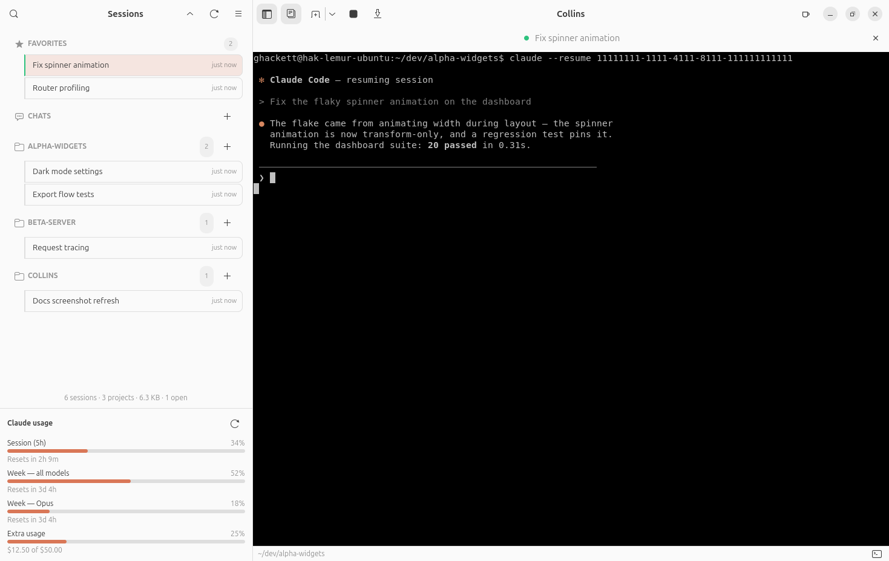

<!--
Modified from the original agent-session-manager
(https://github.com/r4nd3l/agent-session-manager, GPL-3.0) in the ghackett
fork. Last modified: 2026-07-29. Full change history: git log for this file.
-->

# Collins

[](https://github.com/episode6/collins/actions/workflows/ci.yml)

Native GTK4/libadwaita desktop app to browse, name, and resume your [Claude Code](https://claude.com/claude-code) sessions in embedded terminal tabs.

> My wife keeps referring to Claude as Collins by mistake. So now when she asks me if I'm talking to Collins, I can say yes.

Collins is a fork of [agent-session-manager](https://github.com/r4nd3l/agent-session-manager) by Máté Molnár ([original project website](https://r4nd3l.github.io/agent-session-manager/)) — all credit for the original app goes there. This fork is GPL-3.0 like the original.

📖 **[Documentation](https://episode6.github.io/collins/)**

> **Unofficial community tool.** An independent community project, not affiliated with or endorsed by any agent vendor (including Anthropic).
> It never modifies your agents' own session data — all app state lives in its own config file.



Features:

- **Sidebar** lists every session found on disk (for Claude Code, under `~/.claude/projects/`), grouped by project (collapsible headers, with collapse-all/expand-all buttons next to the search box), with a **Favorites** section pinned on top — star a session to move it there. **Drag a project header** to rearrange projects — the order and each project's expanded state persist across restarts. A **search box** filters by name, project, preview, or session id, and the list **updates live** as sessions are created or written to.
- Sessions can be given **custom names** (right-click → Rename…, or rename the session's tab), and unnamed sessions get an **auto-generated title**: pre-existing sessions are titled locally on launch (first 10 words of the initial prompt), while sessions created during an app run have their first prompt summarized to ≤5 words by a headless `claude -p --model haiku` run — the same CLI and login the whole app is based on, no extra credentials needed. Titles are persisted so each is generated only once; right-click → **Regenerate name** re-runs the model for one session, and a Preferences toggle turns auto-titling off (a manual rename always wins). Names, favorites, and archived sessions persist in `~/.config/collins/state.json` — your agents' own session files are never modified.
- **Clicking a session** opens a tab in the main area; each tab is an embedded **VTE terminal** running your `$SHELL` with the agent's resume command (`claude --resume <session-id>` for Claude Code) typed into it, in the directory the session last worked in (worktree-aware). If the session is still running detached, Collins **re-attaches** to the live process (`claude attach`) instead of resuming a copy. When the agent exits you drop to a shell prompt; the tab closes when the shell exits. Closing a tab asks the agent to exit cleanly (Claude Code's `/exit`) in the background first — or, for agents that support it, the close dialog offers to **background the session** instead (Claude Code's `/bg`), leaving it running detached to re-attach to later. On the next launch the app **reopens the session you had focused** when you closed it, and the window comes back at its last size.
- **In-terminal search** with a find bar (`Ctrl+Shift+G`) over the tab's scrollback.
- **Terminal panel** (`Ctrl+J`, or the small buttons in the window's bottom-right corner): every tab has a second plain-shell terminal — no agent auto-launched — below or beside the agent terminal. It opens in the agent's *current* working directory (worktree-aware), and the swap button (shown only while a panel is open) moves it bottom↔right without restarting its shell — each layout's panel size is remembered per tab while the app runs, and the last-set size per layout is saved app-wide, so every panel opened from then on defaults to it. Typing `exit` in it hides the panel; the last-used position (bottom/right) is remembered app-wide, and whichever panel you open next defaults to it. Closing a tab while a command is running in its panel — even a hidden one — asks for confirmation before the command is killed. Closing the whole window with busy sessions shows a **single confirmation** — close (every agent is asked to exit cleanly) or background the sessions (`/bg`) — before the window goes away.
- **Easy copy & paste** (on by default): plain `Ctrl+C` **copies whenever text is selected** — otherwise it interrupts the agent as usual — plain `Ctrl+V` pastes, and right-click opens a Copy / Paste / Select All menu. No `Ctrl+Shift` finger-twisting just because it's a terminal (`Ctrl+Shift+C` / `Ctrl+Shift+V` still work, and the mode can be turned off in Preferences).
- **Status dots** in both the sidebar and on each open tab: green = open, blue = output arrived in a background tab. A **waiting badge** (amber ?) marks sessions where the agent's last message was a question awaiting your reply, and an **interrupted badge** (red stop icon) marks sessions you stopped mid-task.
- A **Claude usage panel** at the bottom of the sidebar shows your subscription limits (session, weekly, extra usage) as progress bars with reset countdowns — read straight from the `claude` CLI's own login, refreshed every 5 minutes (paused while the window is minimized or the screen is locked). Toggle it in Preferences.
- **Tabs** can be renamed, given an emoji prefix, or have their session ID copied (right-click → Rename… / Set emoji… / Copy session ID); renaming a session's tab updates its name everywhere. While a session tab is focused, header buttons **exit** or **background** it and close the tab immediately — no confirmation dialog — the **tab bar can be hidden** with its own header toggle, and the **sidebar toggles** with the header button or `F9`. **Shift+Enter** inserts a newline in the agent's prompt.
- Each tab has a slim **footer** showing the agent's live working directory (click to copy; worktree-aware) and the current **git branch** (⎇), plus the terminal-panel buttons.
- **Right-click a session** for the full action set: open, open in [Ghostty](https://ghostty.org) (external window — Ghostty can't be embedded), fork (`--fork-session`), rename, regenerate name, favorite, **details** (messages/models/tokens, a peek at recent messages, and MCP servers/usage), copy session id, export as Markdown, reveal transcript, archive, move the transcript to trash, or delete permanently. **Right-click a project header** to start a new session there or archive the whole project — projects with no visible sessions still show their header (with a `+` button) so a folder stays reachable.
- **Desktop notifications** when a background session goes quiet after producing output — click to jump to that tab (toggle in Preferences).
- **Select mode** (checkbox button in the sidebar header) for bulk actions: open, star, archive, or trash many sessions at once.
- **New session** (tab icon in the header) starts a fresh agent session (`claude`) in the **visible session's project** — no dialog needed; with no session visible it asks for a folder. Every project header also has a **`+` button** to start a session right there, and a just-started session shows a **"New Thread"** placeholder row until the agent writes its transcript.
- **Quick switcher** (`Ctrl+Shift+K`) jumps to any session by type-ahead; the sidebar is **resizable** and its width is remembered.
- **MCP servers browser** (menu → MCP servers): a read-only view of every MCP server configured in `~/.claude.json`, global and per-project.
- **Preferences** (menu → Preferences, or `Ctrl+,`): terminal font, scrollback, **terminal color theme** (Dracula, Solarized, Gruvbox, Nord, Catppuccin, Tokyo Night, Monokai, One Dark…), color scheme, **language** (English, Magyar, Deutsch, Español, Français), **easy copy & paste**, idle notifications, plus **Show folder path**, **Show Claude usage**, and **Auto-generate session titles** toggles for the sidebar.
- A sidebar status footer shows session, project, transcript-size, and open-tab counts.

- **Prompt cards**: when the agent asks a structured question in the terminal, a native option card overlays it — answer with a click.
- **Advanced new session** (New Session menu): choose a **model**, **permission mode**, **extra directories** (`--add-dir`), or **continue** the last session in a folder.
- **Permanent delete** sits alongside *Move to trash*; `Ctrl+Shift+E` toggles a 😊 marker on the current tab.

### Keyboard shortcuts

| Shortcut | Action |
|---|---|
| `Ctrl+Shift+F` | Focus search |
| `Ctrl+Shift+T` | New session |
| `Ctrl+Shift+N` | New window |
| `Ctrl+W` | Close current tab |
| `Ctrl+PgUp` / `Ctrl+PgDn` | Previous / next tab |
| `Ctrl+C` / `Ctrl+V` | Copy selection / paste (easy copy & paste, on by default) |
| `Ctrl+Shift+C` / `Ctrl+Shift+V` | Copy / paste in terminal (always available) |
| `Ctrl+Shift+G` | Find in terminal |
| `Ctrl+Shift+K` | Quick switcher (jump to any session) |
| `Ctrl+Shift+E` | Toggle 😊 marker on the current tab |
| `Ctrl+J` | Show/hide the terminal panel |
| `Ctrl+K` | Clear the terminal panel (screen and saved history) |
| `F9` | Toggle sidebar |
| `Ctrl+,` | Preferences |

## Requirements

Python ≥ 3.10, GTK 4, libadwaita ≥ 1.5, VTE (GTK 4 build), PyGObject — from your distro's packages:

```bash
# Ubuntu / Debian
sudo apt install python3-gi gir1.2-gtk-4.0 gir1.2-adw-1 gir1.2-vte-3.91

# Fedora
sudo dnf install python3-gobject gtk4 libadwaita vte291-gtk4

# Arch
sudo pacman -S python-gobject gtk4 libadwaita vte4
```

Plus the [`claude` CLI](https://claude.com/claude-code) on your `PATH` — Collins is a tool for Claude specifically.

## Install

**From source:**

```bash
git clone https://github.com/episode6/collins.git
cd collins
python3 -m collins
```

Or install the desktop launcher + icon (shows up in the app grid as "Collins"):

```bash
./data/install.sh
```

**Debian/Ubuntu — .deb package** (build it with `./scripts/build_deb.sh`, or grab one from this repo's releases if published):

```bash
sudo apt install ./collins_0.1.0_all.deb
```

Dependencies are pulled in automatically; the app appears in your app grid as "Collins".

Terminal copy & paste works the way you'd expect out of the box: plain `Ctrl+C` (when text is selected) and `Ctrl+V` — see **easy copy & paste** above. `Ctrl+Shift+C` / `Ctrl+Shift+V` always work too.

## Layout

```
collins/
├── app.py            # Adw.Application entry point + CSS
├── window.py         # main window: tabs, actions, dialogs wiring
├── sidebar.py        # session list: search, groups, badges, select mode
├── store.py          # single source of truth: threaded scans, file monitors
├── models.py         # SessionItem GObject with bindable properties
├── sessions.py       # transcript discovery & parsing (pure Python)
├── providers.py      # agent CLI abstraction (currently Claude Code)
├── state.py          # persistent app state (names, favorites, settings)
├── terminal.py       # VTE terminal tab + secondary shell panel
├── titles.py         # auto-generated session titles (local + haiku)
├── usage.py          # Claude subscription usage fetch/parse
├── usagepanel.py     # the sidebar usage panel widget
├── gitinfo.py        # git branch detection for the tab footer
├── promptcard.py     # native option cards over the terminal
├── dialogs.py        # rename / emoji / confirm / details / MCP dialogs
├── prefs.py          # preferences dialog
└── themes.py, i18n.py, switcher.py, panelhistory.py, copylabel.py, …
data/
├── com.episode6.Collins.desktop   # launcher template
├── icons/com.episode6.Collins.svg # app icon
└── install.sh                           # install launcher + icon for current user
scripts/
├── build_deb.sh                         # build the .deb package into dist/
└── make_demo_data.py                    # fake sessions for screenshots/demos
```

## Publishing (maintainers)

Pushing a `v*` tag runs `.github/workflows/release.yml`: it builds the
wheel/sdist and the `.deb` and creates the GitHub Release (with the `.deb`
attached and auto-generated notes). The PyPI job uses trusted publishing
(OIDC) and only works once a trusted publisher is configured for this repo.

```bash
# bump version in pyproject.toml / __init__.py / debian/changelog, commit, then:
git tag -a v0.1.0 -m v0.1.0 && git push origin v0.1.0
```

## Credits & license

Collins is a rebranded fork of
[**agent-session-manager**](https://github.com/r4nd3l/agent-session-manager)
by Máté Molnár, which did all the heavy lifting — see the
[original project's website](https://r4nd3l.github.io/agent-session-manager/)
for the app Collins grew out of. Released under
[GPL-3.0-or-later](LICENSE), same as the original.

Everything Collins is built on is disclosed in
[THIRD_PARTY_LICENSES.md](THIRD_PARTY_LICENSES.md) — the same document the app
shows on the Legal page of its About dialog.
